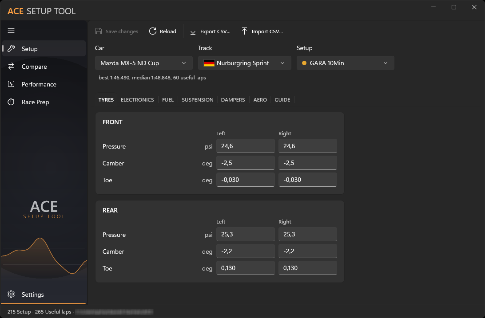
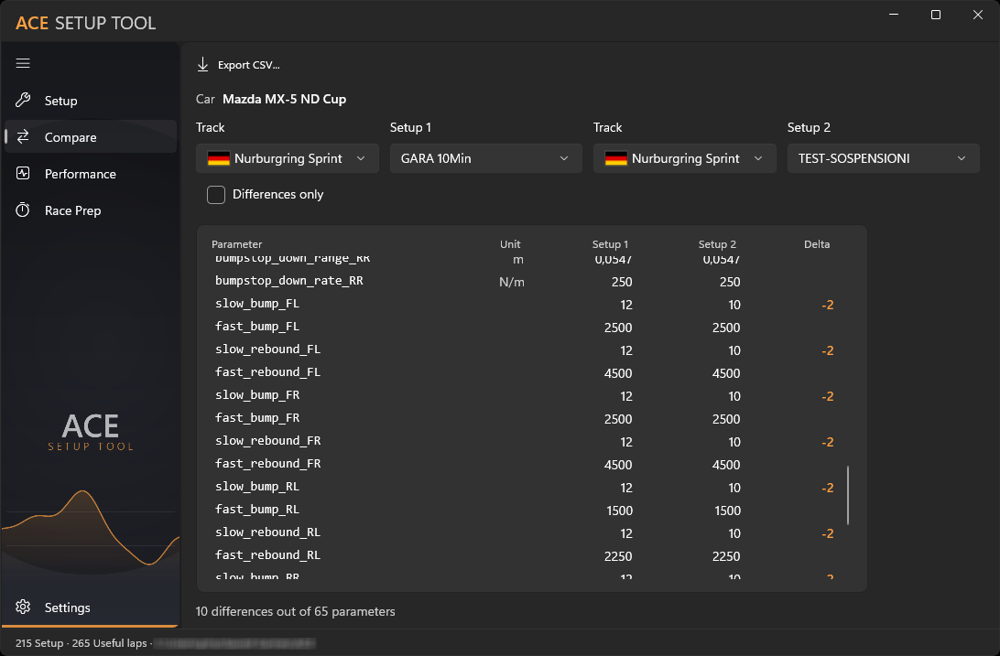
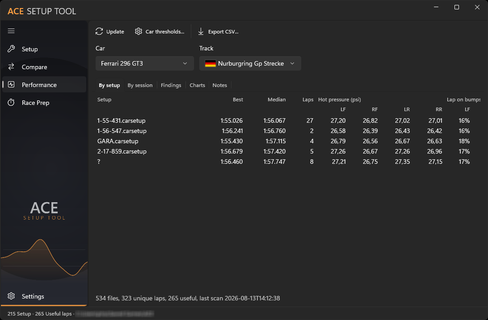
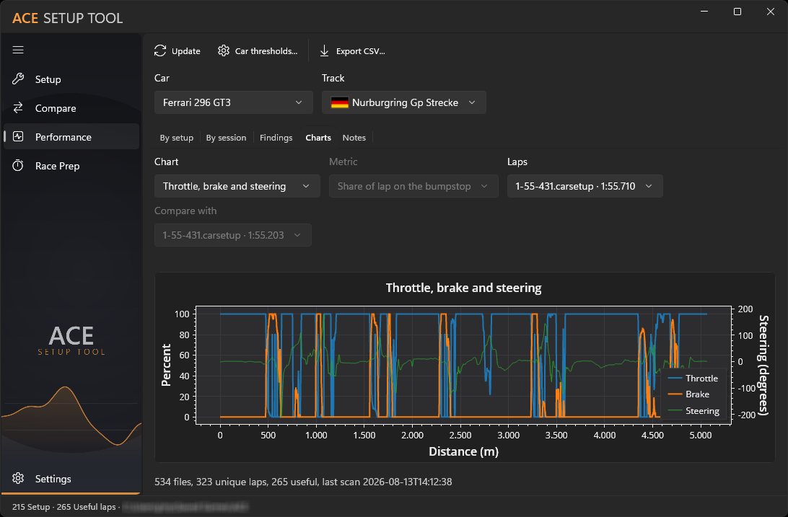
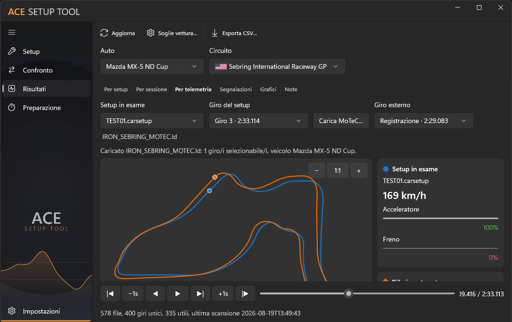
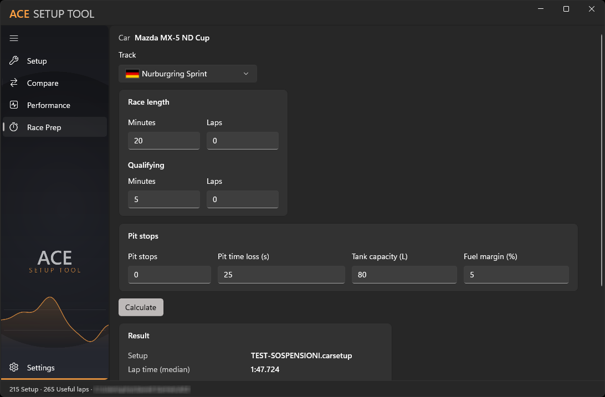

# ACE Setup Tool

[English](README.md) | [Italiano](README.it.md) | **Español**

ACE Setup Tool es una aplicación de escritorio para Windows que permite gestionar,
comparar y analizar los reglajes de los vehículos de **Assetto Corsa EVO**. Lee y
escribe archivos `.carsetup`, importa telemetría MoTeC y ofrece diagnósticos de
rendimiento.

> Repositorio oficial de distribución binaria. El código fuente no se distribuye.

## Descarga

Descarga el instalador, la versión portable y las sumas de comprobación desde
[Releases](https://github.com/agastal/AceSetupTool-Release/releases).

- `AceSetupTool-<versión>-setup.exe` — instalador recomendado;
- `AceSetupTool-<versión>-portable.zip` — versión sin instalación;
- `AceSetupTool-<versión>-setup-net.exe` — instalador más ligero para quien ya tiene
  .NET 10;
- `AceSetupTool-<versión>-portable-net.zip` — la misma versión sin instalación;
- `SHA256SUMS.txt` — huellas SHA-256 de los archivos publicados.

GitHub Releases es el único canal oficial de distribución. No descargues ejecutables
desde espejos ni enlaces de terceros.

## Funciones

- lectura, modificación y copia de seguridad de archivos `.carsetup`;
- comparación de reglajes y exportación CSV;
- exportación a PDF paginado de los valores actuales del reglaje;
- importación de telemetría MoTeC a un archivo local;
- comparación animada de una vuelta archivada con un archivo MoTeC `.ld` externo;
- diagnóstico de presiones, temperaturas, suspensión, caída y altura;
- gráficos y mapas del circuito;
- interfaz en italiano, inglés y español;
- tema claro/oscuro coordinado con Windows.

## Requisitos

- Windows 10/11 x64;
- Assetto Corsa EVO;
- ningún runtime separado: .NET y Windows App SDK están incluidos.

La instalación se realiza por usuario y no requiere privilegios de administrador. El
archivo portable debe extraerse por completo: no copies únicamente el ejecutable.

Los archivos `-net` son el mismo programa sin el runtime de .NET incorporado: 158 MB
instalados en vez de 235, y requieren
[.NET 10 (x64)](https://dotnet.microsoft.com/download/dotnet/10.0) en el equipo. El
Windows App SDK también está incluido en ellos, así que .NET es el único requisito; su
instalador lo comprueba y se detiene con un mensaje en lugar de instalar algo que no
arrancaría. En caso de duda, elige la versión estándar.

Para saber si .NET 10 está presente, abre el terminal y ejecuta `dotnet --list-runtimes`:
si aparece una línea `Microsoft.NETCore.App 10.x`, los archivos `-net` funcionarán. Si no
aparece, o el comando no existe, usa la versión estándar. Windows no incluye .NET 10: lo
que viene preinstalado es .NET Framework, que es otra plataforma.

## Aprobado por Red Kongs

  &nbsp;&nbsp;

ACE Setup Tool es una herramienta **aprobada por Red Kongs**.

## Vista previa

### Reglaje y parámetros de los neumáticos

  

Selecciona coche, circuito y reglaje, y modifica presión, caída y convergencia de cada
rueda en unidades reales. La pantalla también muestra la mejor vuelta, la mediana y las
vueltas útiles, y permite guardar, recargar e intercambiar los datos mediante CSV.

### Comparación en paralelo de reglajes

  

Elige dos configuraciones y compara sus parámetros en una única tabla, con unidades,
valores y diferencias resaltadas. El filtro limita la vista a los cambios, el resumen
indica cuántos parámetros difieren del total y el resultado puede exportarse a CSV.

### Resumen de rendimiento por reglaje

  

Compara para cada reglaje la mejor vuelta, la mediana, el número de vueltas, la presión
en caliente de los cuatro neumáticos y el porcentaje de vuelta sobre los topes de
suspensión. La tabla reúne ritmo, constancia e indicadores esenciales de neumáticos y suspensión.

### Trazas de acelerador, freno y dirección

  

Representa acelerador y freno en porcentaje y el ángulo de dirección en grados a lo
largo de la distancia de la vuelta. Los selectores de vuelta y referencia facilitan el
análisis de frenadas, aplicación del acelerador y correcciones de dirección.

### Comparación animada de telemetría

  

Superpone la vuelta archivada del reglaje a una grabación MoTeC `.ld` externa. La línea
de tiempo sincroniza los marcadores de ambos coches, velocidad, acelerador y freno;
zoom, desplazamiento y ajuste del circuito facilitan comparar trayectorias y mandos.

### Preparación de carrera y cálculo de estrategia

  

Introduce duración de carrera y clasificación, paradas previstas, tiempo perdido en
boxes, capacidad del depósito y margen de combustible. El cálculo utiliza el coche y
el circuito seleccionados para resumir la estrategia según el reglaje y su tiempo mediano.

## Datos y privacidad

La configuración y el archivo de telemetría se guardan localmente:

| Datos | Ubicación |
|---|---|
| Configuración | `%APPDATA%\AceSetupTool\` |
| Archivo de telemetría | `%LOCALAPPDATA%\AceSetupTool\` |

ACE Setup Tool no implementa telemetría del usuario ni transmisión remota de reglajes
o datos de conducción. Las interacciones con GitHub para descargas, Issues u otras
funciones del sitio son externas a la aplicación y están sujetas a las condiciones de
GitHub. No publiques en una Issue registros, reglajes o telemetría con información que
quieras mantener privada.

## Licencia

ACE Setup Tool es **freeware propietario**, distribuido únicamente en forma binaria.
Puede utilizarse gratuitamente conforme a la [licencia española](LICENSE.es.txt) y la
[EULA española](EULA.es.txt). El texto inglés de la [licencia](LICENSE.txt) y la
[EULA](EULA.en.txt) prevalece en la medida permitida por la legislación aplicable.
También están disponibles la traducción [italiana](LICENSE.it.txt) y su
[EULA](EULA.it.txt).

Las licencias y atribuciones de los componentes incluidos están en
[THIRD-PARTY-NOTICES.txt](THIRD-PARTY-NOTICES.txt) y en el directorio
[`third-party`](third-party/). Los textos de licencias de terceros se conservan en su
idioma original.

## Soporte

Para comunicar un problema, utiliza [Issues](https://github.com/agastal/AceSetupTool-Release/issues)
e indica la versión de la aplicación, la versión de Windows y los pasos para
reproducirlo.

## Marcas y afiliación

ACE Setup Tool es un proyecto independiente y no oficial. No está afiliado, aprobado
ni respaldado por Kunos Simulazioni ni por el editor de Assetto Corsa EVO. Los nombres
de productos y las marcas pertenecen a sus respectivos propietarios.

Copyright © 2026 Adriano Gastaldello. Todos los derechos reservados.
